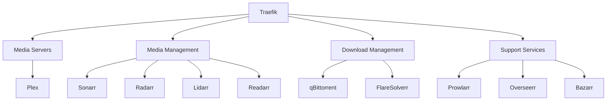

# Services Guide

## Overview

### Service Categories

1. Media Servers
2. Media Management
3. Download Management
4. System Management
5. Support Services

## Media Servers

### Plex Media Server

- **Purpose**: Primary media streaming server
- **URL**: `http://plex.<domain>`
- **Port**: 32400
- **Features**:
  - Media streaming
  - Live TV & DVR
  - User management
  - Remote access
  - Mobile sync
- **Configuration**:
  ```yaml
  volumes:
    - ${CONFIG_ROOT}/plex:/config
    - ${STORAGE_ROOT}/MOVIES:${MOVIES_PATH}:ro
    - ${STORAGE_ROOT}/SERIES:${SERIES_PATH}:ro
    - ${STORAGE_ROOT}/AUDIO:${MUSIC_PATH}:ro
  ```

## Media Management

### Sonarr

- **Purpose**: TV Series management
- **URL**: `http://sonarr.<domain>`
- **Port**: 8989
- **Features**:
  - TV show tracking
  - Episode downloading
  - Quality management
  - Release profiles
- **Integration**:
  - Prowlarr for indexers
  - qBittorrent for downloads
  - Plex for updates

### Radarr

- **Purpose**: Movie management
- **URL**: `http://radarr.<domain>`
- **Port**: 7878
- **Features**:
  - Movie tracking
  - Quality profiles
  - Custom formats
  - Release management

### Lidarr

- **Purpose**: Music management
- **URL**: `http://lidarr.<domain>`
- **Port**: 8686
- **Features**:
  - Artist tracking
  - Album management
  - Quality profiles
  - Metadata handling

### Readarr

- **Purpose**: Book management
- **URL**: `http://readarr.<domain>`
- **Port**: 8787
- **Features**:
  - Author tracking
  - Book management
  - Format preferences
  - Metadata management

## Download Management

### qBittorrent

- **Purpose**: Torrent client
- **URL**: `http://qbittorrent.<domain>`
- **Port**: 8080
- **Features**:
  - Category management
  - RSS automation
  - Sequential downloads
  - Web interface
- **Configuration**:
  ```yaml
  environment:
    - WEBUI_PORT=8080
  volumes:
    - ${CONFIG_ROOT}/qbittorrent:/config
    - ${STORAGE_ROOT}/TORRENTS:${DOWNLOADS_PATH}
  ```

### FlareSolverr

- **Purpose**: Cloudflare bypass
- **URL**: `http://flaresolverr.<domain>`
- **Port**: 8191
- **Features**:
  - Cloudflare protection bypass
  - Browser automation
  - API interface

## System Management

### Portainer

- **Purpose**: Container management
- **URL**: `http://portainer.<domain>`
- **Port**: 9000
- **Features**:
  - Container control
  - Resource monitoring
  - Stack management
  - Image updates

### Traefik

- **Purpose**: Reverse proxy
- **URL**: `http://traefik.<domain>`
- **Port**: 80
- **Features**:
  - Automatic SSL
  - Service discovery
  - Load balancing
  - Middleware support
- **Configuration**:
  ```yaml
  command:
    - --api.dashboard=true
    - --providers.docker=true
    - --entrypoints.web.address=:80
  ```

### Watchtower

- **Purpose**: Automatic updates
- **Features**:
  - Container updates
  - Notifications
  - Schedule management
- **Configuration**:
  ```yaml
  environment:
    - WATCHTOWER_SCHEDULE=0 0 4 * * *
    - WATCHTOWER_CLEANUP=true
  ```

## Support Services

### Overseerr

- **Purpose**: Media requests
- **URL**: `http://overseerr.<domain>`
- **Port**: 5055
- **Features**:
  - Request management
  - User access control
  - Plex integration
  - Notification system

### Bazarr

- **Purpose**: Subtitle management
- **URL**: `http://bazarr.<domain>`
- **Port**: 6767
- **Features**:
  - Subtitle download
  - Multiple providers
  - Language management
  - Sonarr/Radarr integration

### Prowlarr

- **Purpose**: Indexer management
- **URL**: `http://prowlarr.<domain>`
- **Port**: 9696
- **Features**:
  - Indexer aggregation
  - API integration
  - Search optimization
  - Statistics tracking

### Homarr

- **Purpose**: Dashboard
- **URL**: `http://homarr.<domain>`
- **Port**: 7575
- **Features**:
  - Service organization
  - Status monitoring
  - Custom widgets
  - Integration tools

### Recyclarr

- **Purpose**: Configuration management
- **Features**:
  - Quality profiles
  - Release profiles
  - Custom formats
  - Automated sync

### Deleterr

- **Purpose**: Media cleanup
- **URL**: `http://deleterr.<domain>`
- **Port**: 7474
- **Features**:
  - Automated cleanup
  - Rule-based deletion
  - Integration with \*arr services

## Service Dependencies



## Resource Usage

| Service     | CPU Usage | RAM Usage  | Storage    |
| ----------- | --------- | ---------- | ---------- |
| Plex        | High      | 2-4GB      | Varies     |
| Sonarr      | Low       | 500MB      | 1GB        |
| Radarr      | Low       | 500MB      | 1GB        |
| qBittorrent | Medium    | 500MB      | Varies     |
| Prowlarr    | Low       | 200MB      | 500MB      |
| Others      | Low       | 200MB each | < 1GB each |

## Service Management

### Starting Services

```bash
./captainarr.sh start [service]
```

### Stopping Services

```bash
./captainarr.sh stop [service]
```

### Viewing Logs

```bash
./captainarr.sh logs [service]
```

### Updating Services

```bash
./captainarr.sh update [service]
```

## Service Configuration Files

### Location

All service configurations are stored in:

```bash
${CONFIG_ROOT}/[service-name]/
```

### Backup

```bash
./captainarr.sh backup
```

### Restore

```bash
./captainarr.sh restore [backup-file]
```
